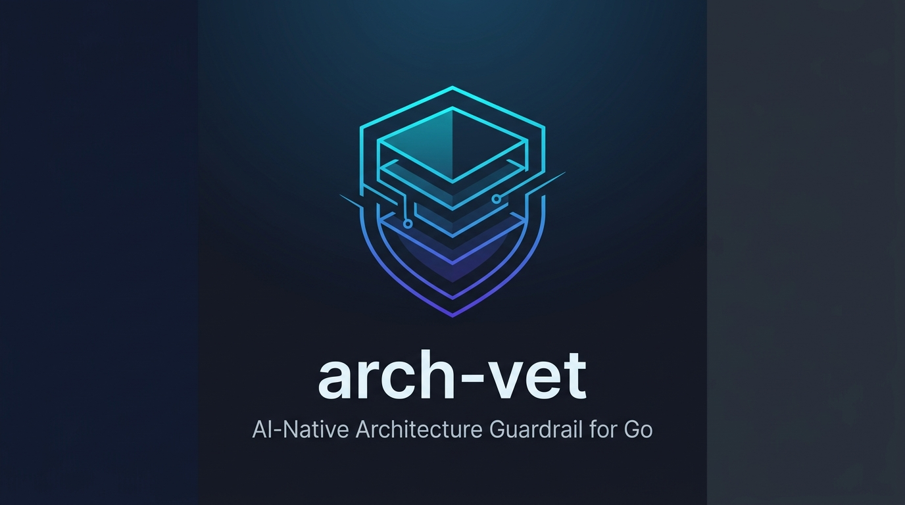

<div align="center">



# arch-vet

**The AI-Native Architecture Linter & Guardrail for Go**

[](https://golang.org)
[](https://github.com/SalvucciFacundo/arch-vet/actions/workflows/ci.yml)
[](https://github.com/SalvucciFacundo/arch-vet/releases)
[](https://modelcontextprotocol.io)
[](LICENSE)

<p align="center">
  <a href="#key-features">Key Features</a> •
  <a href="#installation">Installation</a> •
  <a href="#quick-start">Quick Start</a> •
  <a href="#mcp-server-for-ai-agents">MCP Server</a> •
  <a href="#rule-catalog">Rules</a> •
  <a href="docs/ARCHITECTURE.md">Architecture</a>
</p>

</div>

---

## The Problem: Architecture Erosion in the AI Era

Autonomous AI coding agents (Claude Code, Cursor, Copilot, Aider) generate code at unprecedented speeds. However, they frequently cause **silent architectural rot**:
* Importing database drivers (`database/sql`, `gorm`) or HTTP handlers directly into core domain entities.
* Coupling application use cases to web frameworks (`*gin.Context`, `*http.Request`).
* Defining interfaces on the producer/adapter side rather than on the consumer side.

Existing Go architecture linters are stuck in the pre-AI era: they demand verbose 100-line YAML configuration files, only check raw package imports, and dump cryptic error messages that confuse LLMs.

**`arch-vet` solves this.** It combines zero-config layout auto-detection, deep AST semantic inspection, and an actionable self-healing format tailored for both human developers and autonomous AI agents.

---

## Key Features

* 🚀 **Zero-Config Presets:** Automatically detects your architecture layout (`hexagonal`, `clean`, `layered`). No mandatory setup needed.
* 🛡️ **Semantic Guardrails:** Enforces clean boundaries (`ARCH001`), prevents leaky infrastructure types (`ARCH002`), and checks consumer-side interface conventions (`ARCH003`).
* 🤖 **AI Agent Self-Healing (`--format agent`):** Generates structured markdown with the architectural rationale and step-by-step refactoring instructions for LLM context windows.
* 🔌 **Native MCP Stdio Server (`arch-vet mcp`):** Equips Claude Code, Cursor, and other agent runtimes with native tools to inspect boundaries before writing code.
* ⚡ **Pure Go & Blazing Fast:** Built directly on `go/packages` and `go/ast`. Runs in milliseconds with zero heavy external runtimes or daemons.
* 🚦 **CI/CD Quality Gate:** Seamlessly blocks merges on regressions with exit code `1`, colorized terminal reports, and JSON output.

---

## Installation

### Via `go install` (Recommended)
```bash
go install github.com/SalvucciFacundo/arch-vet/cmd/arch-vet@latest
```

### Pre-built Binaries
Download static binaries for Linux, macOS, and Windows from the [GitHub Releases](https://github.com/SalvucciFacundo/arch-vet/releases) page.

---

## Quick Start

### 1. Run with Auto-Detection
Navigate to any Go repository and run:
```bash
arch-vet
```
`arch-vet` scans your package structure, identifies the layout, and verifies compliance immediately.

### 2. Force an Architecture Preset
```bash
# Hexagonal (Ports & Adapters)
arch-vet -preset hexagonal

# Clean Architecture
arch-vet -preset clean
```

### 3. Agent Mode (For AI Coding Tools)
```bash
arch-vet -format agent
```

#### Example Output:
```markdown
## Architecture Violations Detected (1)

Please fix the following architectural regressions before finalizing your changes:

### 1. [ARCH002] domain-leaky-type
* **Location:** `internal/core/services/order.go:28:34`
* **Problem:** layer "application" function "CreateOrder" parameter leaks infrastructure type "http.Request" (http.Request transport object)
* **Architectural Rationale:** Core business functions in layer "application" must be transport-agnostic. Accepting "http.Request" directly couples use-cases to an HTTP or persistence implementation.
* **Self-Healing Action:** Pass a pure Go struct (command/query DTO) or context.Context instead of http.Request.
```

---

## MCP Server (For AI Agents)

`arch-vet` includes a built-in [Model Context Protocol (MCP)](https://modelcontextprotocol.io) server over `stdio`.

### Configuration
Add `arch-vet` to your AI agent configuration (e.g. `~/.config/claude/claude_desktop_config.json` or Cursor agent settings):

```json
{
  "mcpServers": {
    "arch-vet": {
      "command": "arch-vet",
      "args": ["mcp"]
    }
  }
}
```

### Exposed MCP Tools:
| Tool Name | Description |
| :--- | :--- |
| `verify_architecture` | Audits the project and returns structured violations with actionable self-healing guidance. |
| `get_architectural_map` | Provides the agent with the blueprint of layers and allowed dependency flows before generating code. |
| `explain_rule` | Explains the architectural principles behind rules with concrete Go refactoring code examples. |

---

## Custom Configuration (Optional)

To define bespoke architectural boundaries, create a `.arch-vet.yaml` in your project root:

```yaml
version: v1
architecture: custom

layers:
  - name: domain
    description: Core domain entities and business rules
    patterns:
      - "internal/domain/**"
    may_depend_on: []
    deny_external:
      - "database/sql"
      - "gorm.io/gorm"
      - "net/http"

  - name: application
    description: Use cases and orchestration services
    patterns:
      - "internal/application/**"
    may_depend_on:
      - domain
    deny_external:
      - "net/http"

  - name: adapters
    description: Inbound and outbound infrastructure adapters
    patterns:
      - "internal/adapters/**"
    may_depend_on:
      - domain
      - application
```

---

## Rule Catalog

| Rule ID | Name | Severity | Description |
| :---: | :--- | :---: | :--- |
| `ARCH001` | `forbidden-import` | **Error** | Package imports a forbidden inner/outer layer or denied infrastructure driver. |
| `ARCH002` | `domain-leaky-type` | **Error** | Core domain or application structs/signatures leak infrastructure or transport types (`*sql.DB`, `*http.Request`, etc.). |
| `ARCH003` | `producer-interface` | **Warning** | Interfaces declared inside adapter/infrastructure packages instead of the consumer package. |

---

## CLI Reference

```
Usage of arch-vet:
  -config string
        Path to custom configuration file (default ".arch-vet.yaml")
  -dir string
        Root directory of the Go project (default ".")
  -format string
        Output format: text, json, agent (default "text")
  -no-color
        Disable ANSI color output in terminal
  -preset string
        Architecture preset: hexagonal, clean (defaults to auto-detection)
  -version
        Print version and exit
```

---

## Contributing

Contributions are welcome! Please read [CONTRIBUTING.md](CONTRIBUTING.md) and [docs/ARCHITECTURE.md](docs/ARCHITECTURE.md) to get started.

---

## License

[MIT](LICENSE) © 2026 Facundo Salvucci
