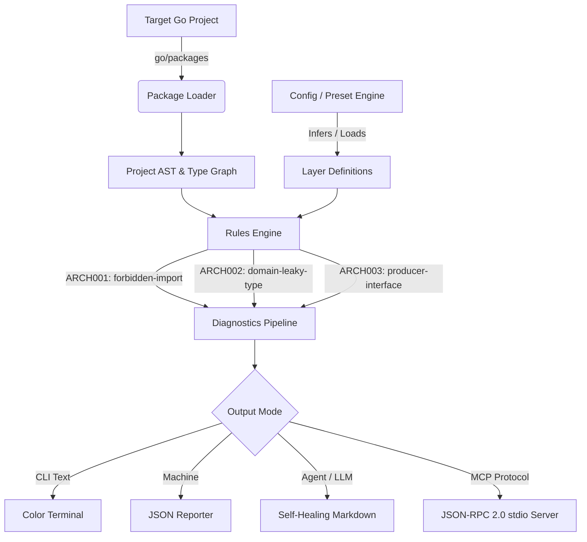

# Architecture & Internals of `arch-vet`

This document details the internal design, domain model, and data pipeline of `arch-vet`.



---

## 1. Package Analysis Pipeline (`internal/analyzer`)

Unlike regex-based linters, `arch-vet` uses Go's official `golang.org/x/tools/go/packages` engine with:
* `NeedName | NeedFiles | NeedCompiledGoFiles | NeedImports | NeedDeps | NeedSyntax | NeedTypes | NeedTypesInfo | NeedModule`

### Key Data Structures
* **`PackageInfo`**: Encapsulates the package path, relative path within the module, parsed AST syntax (`[]*ast.File`), type information, and exact source token positions (`token.Position`).
* **`Project`**: Root container mapping all loaded packages by package ID.

---

## 2. Configuration & Preset Inference (`internal/config`)

`arch-vet` follows a **Zero-Config First** philosophy:
1. If `.arch-vet.yaml` exists, it is loaded.
2. If `--preset <name>` is provided, that preset is loaded.
3. If neither is specified, `DetectArchitecture(rootDir)` scans directory conventions (e.g. `internal/core/domain`, `internal/adapters`, `internal/usecase`) to select the best match (defaults to Hexagonal).

### Layer Matching
Layer patterns use path globbing:
* `internal/domain/**`: Matches any package under `internal/domain`.
* `internal/infra*`: Matches `internal/infra`, `internal/infrastructure`, etc.

---

## 3. Semantic Rule Engine (`internal/rules`)

Rules implement the `Rule` interface:

```go
type Rule interface {
    ID() string
    Name() string
    Evaluate(ctx *Context) []Diagnostic
}
```

Every diagnostic carries:
* `RuleID` and `RuleName`
* Exact `Position` (file, line, column)
* Concise human `Message`
* Detailed architectural `Explanation`
* Actionable `Remediation` pattern for AI agent self-healing.

### Built-in Rules:
* **`ARCH001` (`forbidden-import`)**: Cross-layer boundaries and external driver denial.
* **`ARCH002` (`domain-leaky-type`)**: AST inspection of struct fields and function/method signatures in core layers to ensure transport/database drivers do not leak into business logic.
* **`ARCH003` (`producer-interface`)**: Detects interfaces declared in adapter/infrastructure layers instead of consumer packages.

---

## 4. MCP Stdio Server (`internal/mcp`)

`arch-vet mcp` runs a stateless JSON-RPC 2.0 protocol over `os.Stdin` and `os.Stdout`:
* **Zero runtime dependencies:** Uses Go standard library `bufio.Scanner` and `encoding/json`.
* **Sub-5ms startup:** Allows AI agents to spawn the binary as a lightweight sidecar.
* **Tools exposed:** `verify_architecture`, `get_architectural_map`, and `explain_rule`.
